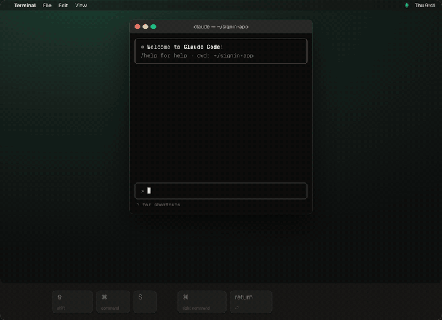
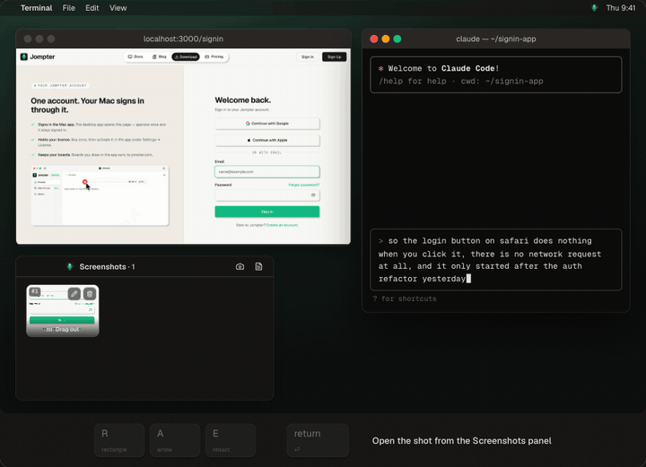
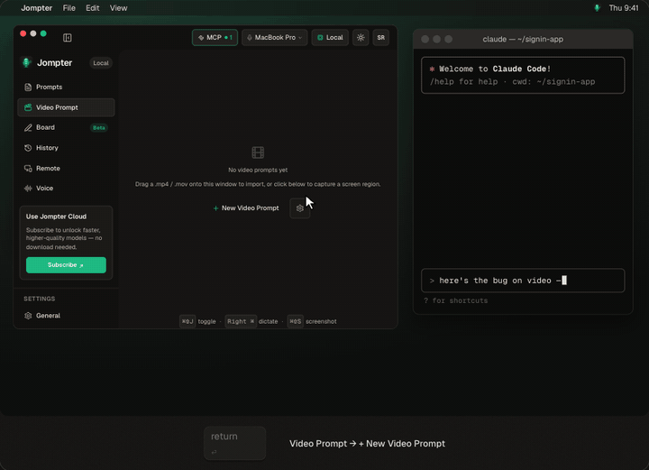
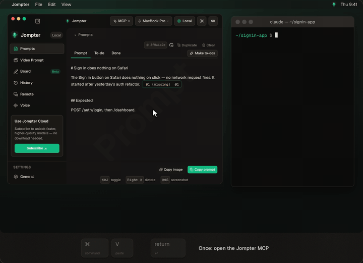
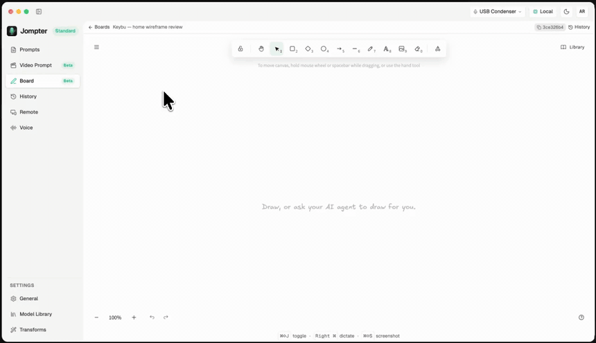
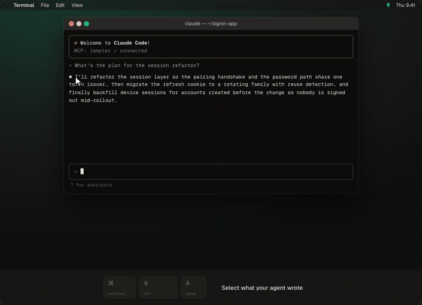
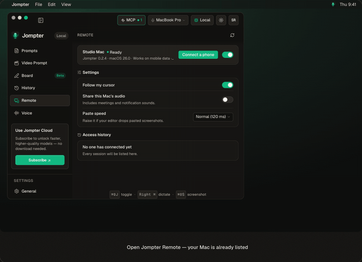

# Jompter for Mac

**Talk to your coding agent. Show it what you mean.**

Jompter turns your **voice, screenshots and screen recordings** into one prompt for
Claude Code, Cursor, Codex or any AI assistant. Speech runs **on your Mac** with
Whisper, Parakeet and Nemotron, so it works offline and nothing is uploaded.

**Free on your Mac.** Dictation, prompts and the hand-off to your agent are unlimited.
Screenshots, screen recordings, boards and Remote are free within limits.

```sh
brew install --cask anshuopinion/jompter/jompter
```

[**Download the .dmg**](https://github.com/anshuopinion/jompter-releases/releases/latest) ·
[Website](https://jompter.com) · [Docs](https://jompter.com/docs) · [Pricing](https://jompter.com/pricing)



---

## How it works

1. **Hold Right ⌘ and talk.** Your words are typed into whatever has focus: the Claude Code
   terminal, Cursor's chat, a browser field.
2. **Show it.** Press ⌘⇧S mid-sentence and an annotated screenshot joins the prompt. Record a
   bug and Jompter keeps the key frames and what you said.
3. **Hand it over.** Paste the prompt, or let your agent read everything itself over a local
   MCP connection.

Every screen below is the real app.

## Features

### Voice to prompt

Hold **Right ⌘** (rebindable), talk, let go. Tap **Right ⌥** for hands-free. Nemotron shows
words as you speak; Parakeet and Whisper transcribe when you stop. Every take is kept in
History, so you can replay it or re-transcribe it with a better model. Optional transforms
polish the text or reshape it into a clear prompt.
[More](https://jompter.com/features/voice-to-prompt)

### Screenshot to prompt



**⌘⇧S** for a region, **⌘⇧F** for the whole screen. Mark it up with a box (R), an arrow (A),
a label (T) or a blur for secrets (E). The marks stay editable, and the original never leaves
your Mac. Drag the tile into your agent as a real file, or copy its path for the terminal.
[More](https://jompter.com/features/screenshot-to-prompt)

### Video Prompt: screen recording to prompt



Claude and most coding agents can't watch a video, but they read images and text well. Video
Prompt records a region while you talk, samples it at 1, 2 or 4 frames a second, drops the
near-duplicates and keeps the key frames (12 by default) with timestamps and your transcript.
Drop in an existing .mp4, .mov, .mkv, .webm or .m4v too. *Beta.*
[More](https://jompter.com/features/screen-recording-to-prompt)

### MCP: your agent reads the whole prompt



Turn on Jompter's local MCP server and connect Claude Code, Cursor, Codex or OpenCode. Paste
one line with the prompt's id and the agent calls `get_prompt`: text, screenshots, recording
frames and transcript in one call. It proposes to-dos, you approve them, and you watch each
one move to done. The server listens only on your Mac, behind an access key.
[More](https://jompter.com/features/mcp-prompts)

### Board: a whiteboard your agent can draw on



Ask for an architecture diagram, a flow or a wireframe, and the agent draws it on a Jompter
board over MCP, with a bundled library of components and icons. Checkpoints let you undo
anything it drew. Export PNG or .excalidraw, or share a view-only link. *Beta.*
[More](https://jompter.com/features/ai-whiteboard)

### Speak: hear it instead of reading it



Select any text and press **⌘⇧A**. Pick one of 10 voices at 0.75× to 1.5×, have it rewritten
as a plain explanation first, or translated into your language. Generated on your Mac.
[More](https://jompter.com/features/read-aloud)

### Jompter Remote: your Mac from your iPhone



Check a long agent run from the couch, tap and type on your Mac, and dictate the next prompt
from your phone. The picture goes straight from your Mac to your phone, encrypted, and our servers never see it. iPhone app in open beta:
[join on TestFlight](https://testflight.apple.com/join/e1EPnYN4).
[More](https://jompter.com/features/control-mac-from-iphone)

## What's free

| | Free | License | Cloud (optional) |
|---|---|---|---|
| Dictation on your Mac | Unlimited | Unlimited | Unlimited |
| Prompts, MCP hand-off, transforms, translation, Speak | Unlimited | Unlimited | Unlimited |
| Screenshots | 20 a day | Unlimited | Unlimited |
| Screen recordings (Video Prompt) | 5 | Unlimited | Unlimited |
| Boards | 3 | Unlimited | Unlimited |
| Remote from iPhone | 1 a day, 10 min | Unlimited | Unlimited |
| Cloud transcription and cloud AI transforms | | | ✓ |

Your first 14 days have no limits at all. The free tier needs a free account, no card.
A license is $99 once or $79 a year. Current prices: [jompter.com/pricing](https://jompter.com/pricing).

## How it compares

| | Jompter | Wispr Flow | Handy | Spokenly | macOS Dictation |
|---|---|---|---|---|---|
| Dictation | Free, unlimited, on-device | Free plan with a limit, then subscription | Free, open source | Free local dictation | Free, built in |
| Screenshots and recordings in the prompt | ✓ | | | | |
| Agent reads the prompt over MCP | ✓ | | | Voice input over MCP | |
| Platforms | Apple Silicon Mac | Mac, Windows, iOS | Mac, Windows, Linux | Mac, Windows, Linux, iPhone | Mac |

Checked against each app's own site in September 2026. Full, fair comparisons:
[jompter.com/alternatives](https://jompter.com/alternatives).

## Works with

Claude Code, Cursor, Codex, OpenCode, GitHub Copilot, VS Code, Windsurf, Gemini CLI and any
app you can type into. Jompter writes a ready-made MCP connection for Claude Code, Cursor,
Codex, OpenCode and Claude Desktop. [Details](https://jompter.com/works-with)

## Install

**Needs** an Apple Silicon Mac (M1 or newer) and macOS 13 Ventura or later. Intel Macs are not
supported. Signed and notarized by Apple.

1. `brew install --cask anshuopinion/jompter/jompter`, or open the `.dmg` and drag Jompter into
   Applications.
2. Launch it and follow the setup steps.
3. Grant the four permissions it asks for:

| Permission | Needed for |
|---|---|
| Microphone | Recording your voice |
| Accessibility | Global hotkeys, typing dictated text, reading your selection |
| Screen Recording | Screenshots, screen recordings, Remote |
| Remote input | Actually sending keystrokes and clicks |

Accessibility and Remote input are **separate** permissions in the same System Settings pane.
Granting only the first is the most common reason dictation seems to do nothing.

Closing the window hides Jompter rather than quitting it. Press **⌘⇧J** to bring it back.

## Docs and help

- [Install and first run](https://jompter.com/docs/getting-started/install)
- [Permissions](https://jompter.com/docs/getting-started/permissions)
- [Plans and access](https://jompter.com/docs/getting-started/plans)
- [Troubleshooting](https://jompter.com/docs/reference/troubleshooting)
- Support: [jompter.com/support](https://jompter.com/support)

This repository hosts release builds only; the source is private. Bugs and feature requests:
[jompter.com/support](https://jompter.com/support).
